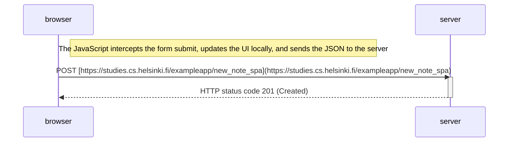

```mermaid
sequenceDiagram
    participant browser
    participant server

    Note right of browser: The JavaScript intercepts the form submit, updates the UI locally, and sends the JSON to the server

    browser->>server: POST [https://studies.cs.helsinki.fi/exampleapp/new_note_spa](https://studies.cs.helsinki.fi/exampleapp/new_note_spa)
    activate server
    server-->>browser: HTTP status code 201 (Created)
    deactivate server
```